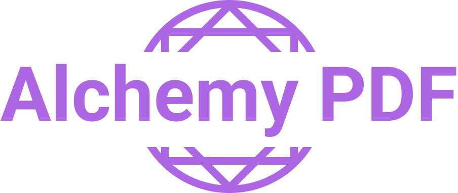

<div>
  <div style="width:100%; text-align: center;">
    
  </div>
  <div style="width:100%; text-align: center;">
  
  
  
  
  
  </div>
</div>

# Alchemy PDF
This project empowers users to effortlessly generate high-quality PDF documents directly from HTML text input. Whether you're looking to create reports, invoices, or any other type of formatted document, this tool streamlines the conversion process. By providing a user-friendly interface and robust backend functionality, Alchemy PDF converter enables individuals and businesses to swiftly transform structured HTML content into professional-looking PDFs, ready for sharing or printing.

## Features

* **HTML Input Flexibility:** Accepts HTML code directly as input, allowing for precise control over the structure and styling of the final PDF.
* **PDF Customization Options:** Provides options to adjust page size, margins, orientation, and other formatting aspects of the generated PDF.
* **Flexibility:** The developer could extends the funcionality of Alchemy PDF.

## Getting Started

### Prerequisites

* Node.js (v18 or higher recommended)
* npm or yarn

### Docker

#### Running Docker container
1. Clone the repository: `git clone https://github.com/EnriqueMendozaPrrfect/alchemy-pdf.git`
2. Navigate to the project directory: `cd alchemy-pdf`
3. Clone the repository: `docker build -t alchemy-pdf .`
4. Create `.env` file in the base of project or rename `.development.env` to `.env`
5. Run container: `docker run -p 9670:9670 alchemy-pdf`

### Local

#### Installation

1. Clone the repository: `git clone https://github.com/EnriqueMendozaPrrfect/alchemy-pdf.git`
2. Navigate to the project directory: `cd alchemy-pdf`
3. Install dependencies: `npm install` or `yarn install`
4. Install playwright `npx playwright install`

#### Configuration

1. Create `.env` file in the base of project or rename `.development.env` to `.env`
2. Assign `PORT` or use the default port `PORT=9670`
3. Assign `ENVIROMENT` or use the default enviroment `ENVIROMENT=development`
4. Assign `MAX_REQUEST_SIZE` or use the default max request size `MAX_REQUEST_SIZE=5mb`
5. Assign `DRIVER_CONVERTER` or use the default driver `DRIVER_CONVERTER=playwright` other options could be `console` or `dummy`

### Running the application

* Development: `npm run start:dev`
* Production: `npm run start:prod`

## API Documentation

> **_NOTE:_**  The Swagger docs are able in development mode in url`{base_url}/docs`

**Endpoint:** 

* `POST {base_url}/v1/convert`

**Request Body:**

```json
{
  "file": "required, HTML content to be converted",
  "format": "optional, types: [Letter, Legal, Tabloid, Ledger, A0, A1, A2, A3, A4, A5, A6]",
  "landscape": "optional, boolean, default: false",
  "margin": {
    "top": "optional, number in pixeles, default: 0",
    "left": "optional, number in pixeles, default: 0",
    "right": "optional, number in pixeles, default: 0",
    "bottom": "optional, number in pixeles, default: 0"
  }
}
```

**Response Header:**
* x-powered-by: `Express`
* access-control-allow-origin: `*`
* content-type: `application/pdf`
* content-length: `size of the pdf file`
* date: `date of response of the pdf file`
* connection: `status of conection`

**Response Body:**
*  `binary file`

## Testing

* `npm run test`

## License

* Alchemy PDF is licensed under the MIT License - see the [LICENSE](LICENSE) file for details.  
